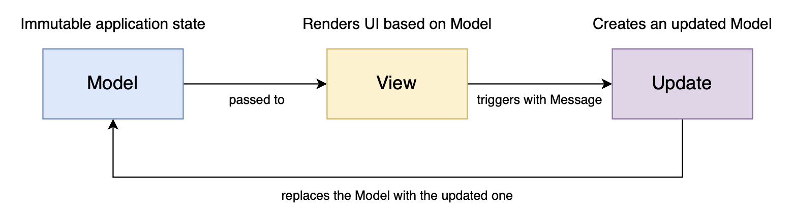

# Architectural design

The software to realize had to exploit the functional programming paradigm, this is the reason why
we choosed to use the **MVU** (Model-View-Update) architectural pattern: it fits well with this paradigm.

In the following figure the typical behaviour of this pattern is shown.

## Model

In this architecture, the Model represents the state of the application, an immutable entity which
is replaced every time a new Update is triggered.

## View

The View provides the GUI and the application, relying on the state of the application (Model). 
It is a simple function which takes in input a Model and returns a graphic interface, without cause any side-effect.

## Update

The Update is the component responsible to update the Model according the the actions triggered by the user through the View.
More specifically, it is a function which takes in input Model and _Message_ and returns the new Model in output.