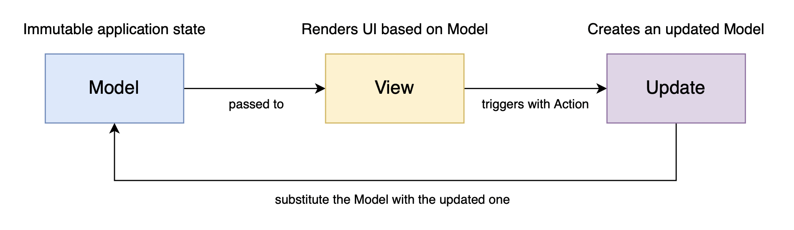

# Design architetturale

Avendo lo scopo di realizzare un software sfruttando principalmente il paradigma funzionale, 
abbiamo scelto di utilizzare il pattern architetturale **MVU** (Model-View-Update) 
che si presta molto bene a questo paradigma.

In figura viene rappresentato il comportamento tipico di questo pattern.

## Model
Il modello in questa architettura rappresenta lo stato dell'applicazione, è un'entità immutabile
la quale viene sostituita ogni qualvolta viene innescato l'Update.

## View
La View fornisce la GUI dell'applicazione basandosi sullo stato dell'applicazione (Model).
È una semplice funzione che prende in input il Model e restituisce l'interfaccia grafica senza provocare alcun side-effect.

## Update
L'Update è la componente responsabile di aggiornare il Model in base alle azioni innescate dall'utente 
tramite la View. In particolare è una funzione che ha come input il Model e un _Action_, e restituisce in output il nuovo modello.