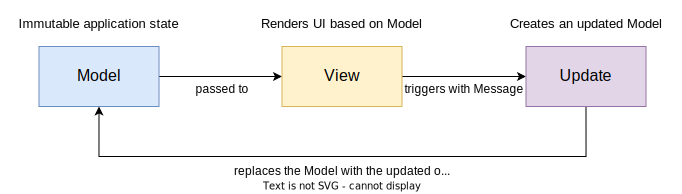

# Architectural design

---

The software to realize had to exploit the functional programming paradigm, this is the reason why
we chose the **MVU** (Model-View-Update) architectural pattern: it fits well with this paradigm.

The following figure shows the typical behavior of this pattern.

    

## Model

In this architecture, the Model represents the state of the application, an immutable entity which
is replaced every time a new Update is triggered.

## View

The View provides the GUI updates for the application, relying on the current state of the application (Model).
It is a simple function that takes in input a Model and returns a set of graphic components, without causing any side
effect and updating the GUI only where it's needed.

## Update

The Update is the component responsible to update the Model according to the actions triggered by the user through the
View.
More specifically, it is a function which takes in input Model and _Message_ and returns the new Model in output.

---

[Previous](2-requirements.md) | [Next](4-detailed-design.md)
