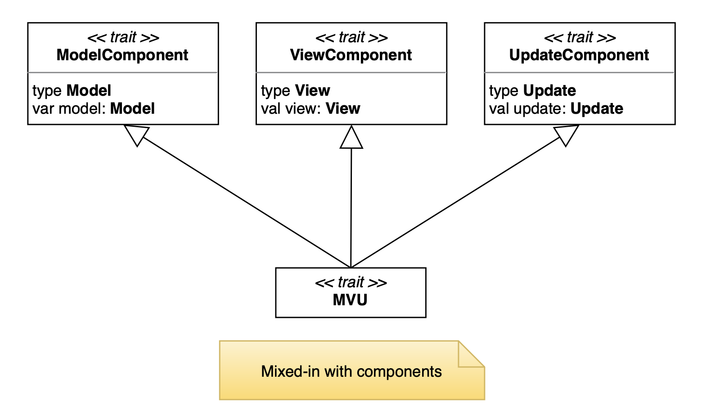
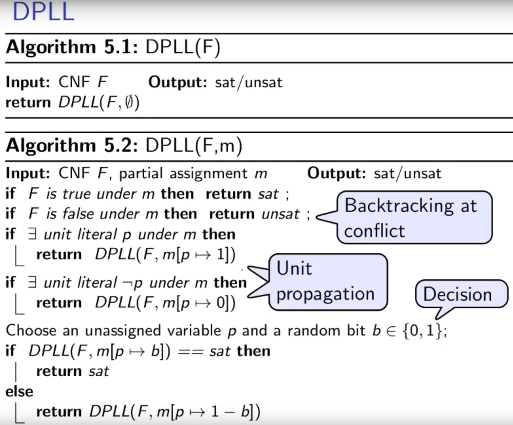

# Detailed Design

## Architecture

As described in the previous section, the architectural pattern used is the **Model-View-Update** (MVU).
Moreover, the **Cake Pattern** has been introduced to improve the modeling of the dependencies.

Some _trait_ has been designed to represent the components of the MVU pattern, which encapsulate within them some
_abstract type members_ related to Model, View and Update.




## Model

Concretely, the **Model** will be a private implementation of the _trait_ **State**, which contains the following
abstract types:

* **Expression**
* **Solution**
* **CNF**
* **Problem**

.....................


---

## View

**View** it will be, as already said, a function that takes as input the **Model** and returns a **GUI** object.
Until now, we have not seen any side effect, but in order to provide a user interface it's necessary having one, so the
**GUI**
object is in charge of render the application.

....................


---

## Update

Finally, the **Update** type will be a function that takes in input the **Model** and a **Message** and returns a new
**Model**.

---

## Core

### DPLL (Davis-Putnam-Loveland-Logemann)

#### Preliminaries

##### Definition of partial model

We will call elements of $Vars \rightarrow \mathcal{B}$ as partial model, e.g. not all variables are assigned at a given
point of the algorithm.

##### State of the literal

Under partial model $m$,

- a literal $l$ is true if $m(l) = 1$;
- $l$ is false if $m(l) = 0$;
- otherwise $l$ is unassigned.

##### State of the clause

Under a partial model $m$,

- a clause (literals put in $\lor$) is true if there is $l \in C$ such that $l$ is true;
- $C$ is false if for each $l \in C$, $l$ is false;
- otherwise $C$ is unassigned.

##### State of a formula

Under a partial model $m$,

- CNF $F$ is true if for each $C \in F$, $C$ is true;
- CNF $F$ is false if there is $C \in F$, such that $C$ is false.
- otherwise $F$ is unassigned

##### Definition of unit clause and unit literal

$C$ is a unit clause under $m$ if a literal $l \in C$ in unassigned and the rest are false, $l$ is called unit literal.

#### DPLL

- maintains a partial model, initially $\emptyset$
- assigns unassignmed variables 0 or 1 randomly one after another
- sometimes forced to choose assignments due to unit literals



##### Unit propagation

Suppose we have the following formula in CNF:

$$(\lnot b \lor c) \land (\lnot c) \land (a \lor \lnot b \lor e) \land (d \lor b)$$

Since $\lnot c$ is the only literal in the clause, if it is false all the formula will be false, so set $c = false$ to
delete the clause and all the others with $\lnot c$ inside. Delete also all the $c$ where the literal appears in
positive form.
On the other hand, if $c$ is in positive form, do viceversa.

##### Pure literals

As a choice to simplify the formula, beyond the unit propagation, it's possible to choose an assignment to a variable (
decision) to a literal which appears only in positive form or only in negative form.

For example:

$$(b \lor c) \land (\lnot c \lor d) \land (a \lor b \lor e) \land (d \lor b)$$

In this case $b$ appears only in positive form, then assigning $b = true$ no other clause will be "penalized", therefore
delete all the other clauses where $b$ is included.

In other words: if $b$ doesn't appear in negative form inside the formula $F$, assigning $b = true$, the satisfability
of $F$ is preserved.

##### Heuristic search

*Idea*: identify the most constrained variable

**MOM**'s heuristic: choose variable based on most occurrence in clauses of minimum length.

## Domain-Specific Language

The user must be able to insert in input a logical expression using a friendly and intuitive syntax, here is an example:

```
!(a and b) or (c and (d -> e))
```

To achieve this goal, it is used an Internal Domain Specific Language (DSL) realized mainly through the _Pimp my
library_ pattern.

Since this mechanism provides a not so versatile syntax (because it strongly depends on Scala syntax) respect to using a
proper parser, the input needs to be preprocessed in order to be adapted to the DSL syntax.

---
[Previous](3-architectural-design.md) | [Next](5-implementation.md)
