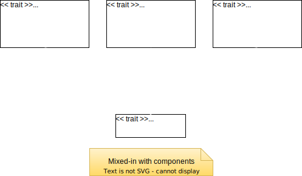
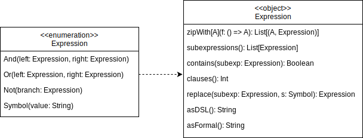
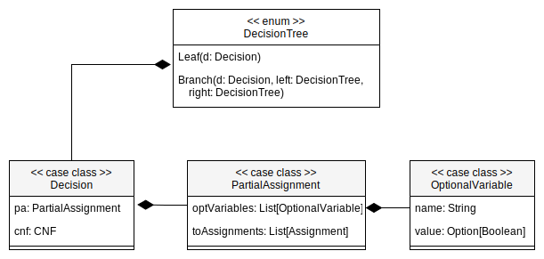

# Detailed Design

---

## Code organization

<p align=center>
  
</p>

## Architecture

As described in the previous section, the architectural pattern used is the **Model-View-Update** (MVU).
Moreover, the **Cake Pattern** has been introduced to improve the modeling of the dependencies.

Some _trait_ has been designed to represent the components of the MVU pattern, which encapsulate within them some
_abstract type members_ related to `Model`, `View` and `Update`.

<p align=center>
  
</p>

## Model

Concretely, the **Model** is an implementation of the _trait_ **State**, which contains the following
abstract types:

### Expression

<p align=center>
  
</p>

Expression is represented through a _sum type_ which contains all the possible types of expression:

- `And`, it represents the logical And gate. It takes in input **left** and **right** parameters both of
  type `Expression`.
- `Or`, it represents the logical Or gate. Like the `And`, it takes a **left** and **right** Expressions in input.
- `Not`, it's the logical Not gate. It takes in input another `Expression`.
- `Symbol`, it represents an input variable and takes in input its name.

Because of its recursive structure, Expression is a tree data structure, where the inner nodes are either
**And**, **Or** or **Not**, and each leaf is a **Symbol**.

### CNF

<p align=center>
  
</p>

`CNF` is the data structure representing logical formulas as a *conjunction* of clauses,
where each clause is a *disjunction* of literals (variables or their negations).

For example:

$$ (a \lor c) \land (a \lor \lnot d) $$

It is a _sum type_ like `Expression`, but it has the following constraints:

- The `Or` gate cannot contain an `And` in either its **left** and **right** parameter.
- The `And` gate cannot contain an `And` in its **left** parameter.
- The `Not` gate can contain only a `Symbol` parameter.
- In this case, `Symbol` can either represent an input variable by specifying its name or a boolean constant by using
  a **Bool** type value.

### Solver

The Solver package contains all the abstract types that are useful for SAT solver implementations, especially for
tree-based search algorithms.

It is composed of:

- **DecisionTree**. It's a binary tree data structure where each node contains a **Decision**. It is constructed during
  the search algorithm.
- **Decision**. A decision represents a constraint that has been applied to an input variable. In turn, it contains:
    - A **PartialAssignment**, which is the current state of constraints applied to the variables. The decision is
      implicitly defined in this field. PartialAssignment is a list of **OptionalVariable**, e.g. a variable which could
      be either be constrained or not.
    - A **CNF**. It's the input CNF updated with the current set of constraints defined in **PartialAssignment**.
- **Constraint**. It consists of the name of the variable, and the boolean constraint. It is an utility which could be
  useful during the solve.

<p align=center>
  
</p>


Given these ingredients, a SAT solver implementation can build its own specific **DecisionTree**, applying decisions to
the variables in a certain order and assigning them a certain value that they deem most appropriate for the resolution.

### Solution

<p align="center">

</p>

### Problem

<p align="center">

</p>

The general SAT problem representation has been designed with a _trait_ **Problem**.
It is composed by:

- A set of constraints that must be all satisfied in the solution.
- An `Expression`, which is the reduction of the constraints using the `And` operator.

Each problem extends **Problem** using a _case class_, and adds the constraints needed to represent the specific
problem.

---

## View

**View** will be, as already said, a function that takes as input the **Model** and returns a set of components.
Until now, we have not seen any side effect, but in order to provide a user interface it's necessary having one, so the
**GUI** object is in charge of render the new state of application showing the new updated components.
In this way, every time the **Model** changes, the **GUI** will be correctly updated but without reloading the entire
UI.

---

## Update

The **Update** type will be a function that takes in input the **Model** and a **Message** and returns an updated new
**Model**.
For every type of message one behaviour is defined, so the **Update** function will be a _match_ on the **Message**
type.
Following this approach, combined with the GUI component to update, every interaction with the user will refresh exactly
the needed part of the UI.

## Core

### Converter

<p align="center">

</p>

Converter is a _trait_ containing the method convert that will be implemented by each converter.
In order to obtain better performances and to avoid the re-computation of same expressions, the converter can keep
a cache of already computed expressions following the _memoization_ pattern.

#### Tseitin Algorithm

The Tseitin algorithm converts a formula in propositional logic into a CNF formula.

In this case, the _Converter_ is in charge of converting the expression in CNF form, using the Tseitin transformation.
It is implemented through a _case class_ that extends the **Converter** trait implementing the convert method.
Following the functional approach, the implementation is hidden inside a private object.
It contains the implementation of the three main algorithm phases.

The idea behind the Tseitin transformation is to introduce new auxiliary variables for subformulas in the original
formula.
These auxiliary variables are used to represent the truth values of the subformulas.

By doing this, the original formula can be broken down into smaller parts, each represented in CNF, and then combined
using the introduced auxiliary variables to maintain the overall semantics of the original formula.

So, the best way to design it is decomposing the algorithm following the steps below:

1. Assign a unique identifier to each subformula in the original formula.
2. Replace each subformula with an auxiliary variable representing its truth value.
   e.g.

   $$(a \land (b \lor c)) \implies (\lnot c \land d)$$
   $$TSTN_4 \Longleftrightarrow \lnot c$$
   $$TSTN_3 \Longleftrightarrow b \lor c$$
   $$TSTN_2 \Longleftrightarrow TSTN_4 \land d$$
   $$TSTN_1 \Longleftrightarrow a \land TSTN_3$$
   $$TSTN_0 \Longleftrightarrow TSTN_1 \implies TSTN_2$$

3. Express the truth conditions of the subformulas in CNF using the auxiliary variables and standard logical
   connectives (AND, OR, NOT) following the transformations listed in the table below.

   | Operator | Circuit                 | Expression      | Converted                                                                     |
                  |----------|-------------------------|-----------------|-------------------------------------------------------------------------------|
   | AND      |  | $X = A \land B$ | $(\lnot A \lor \lnot B \lor X) \land (A \lor \lnot X) \land (B \lor \lnot X)$ |
   | OR       |   | $X = A \lor B$  | $(A \lor B \lor \lnot X) \land (\lnot A \lor X) \land (\lnot B \lor X)$       |
   | NOT      |  | $X = \lnot A$   | $(\lnot A \lor \lnot X) \land (A \lor X)$                                     |

4. Combine the representations of the subformulas to obtain the CNF representation of the entire formula.

The resulting formula is equi-satisfiable with the original formula, meaning they have the same set of satisfying
assignments. This transformation enables the use of various CNF-based algorithms and tools to analyze and reason about
the original logical formula efficiently.

### Solver

<p align="center">

</p>

Solver is a _trait_ containing the methods useful to solve SAT problem encoded in CNF form.
There are two main possibilities to solve a SAT problem instance, one is starting from the CNF form, and the other is
starting directly from the expression.
Furthermore, it is possible to solve the problem looking for all the possible
solutions or only one at a time.
In the last case the solver will convert the expression in CNF with the Converter specified before compute the solution.

In order to obtain better performances and to avoid the re-computation of same expressions,
also the solver makes use of _memoization_ pattern.

### DPLL (Davis-Putnam-Loveland-Logemann)

The DPLL algorithm is a search algorithm for deciding the satisfiability of a propositional formula in Conjunctive
Normal
Form.

Compared to a simple exhaustive search of all the possible variable assignments, DPLL makes use of determined strategies
to guide the search, making it more efficient.
It was introduced in 1961 by Martin Davis, George Logemann and Donald W. Loveland and is a refinement of the earlier
Davis–Putnam algorithm.

In this case, the _Solver_ is in charge of solving the propositional expression using the DPLL algorithm.
It is implemented through a _case class_ that extends the **Solver** trait implementing its methods.
Following the functional approach, the implementation is hidden inside a private object.

#### Preliminaries

##### Definition of partial model

We will call elements of $Vars \rightarrow \mathcal{B}$ as a partial model, e.g., not all variables are assigned at a
given point of the algorithm.

##### State of the literal

Under partial model $m$,

- a literal $l$ is true if $m(l) = 1$;
- $l$ is false if $m(l) = 0$;
- otherwise, $l$ is unassigned.

##### State of the clause

Under a partial model $m$,

- a clause (literals put in $\lor$) is true if there is $l \in C$ such that $l$ is true;
- $C$ is false if for each $l \in C$, $l$ is false;
- otherwise, $C$ is unassigned.

##### State of a formula

Under a partial model $m$,

- CNF $F$ is true if for each $C \in F$, $C$ is true;
- CNF $F$ is false if there is $C \in F$, such that $C$ is false.
- otherwise $F$ is unassigned

##### Definition of unit clause and unit literal

$C$ is a unit clause under $m$ if a literal $l \in C$ in unassigned and the rest are false, $l$ is called unit literal.

#### DPLL

- maintains a partial model, initially $\emptyset$
- assigns unassigned variables 0 or 1 randomly one after another
- sometimes forced to choose assignments due to unit literals


###### Unit propagation

Suppose we have the following formula in CNF:

$$(\lnot b \lor c) \land (\lnot c) \land (a \lor \lnot b \lor e) \land (d \lor b)$$

Since $\lnot c$ is the only literal in the clause, if it is false, all the formula will be false, so set $c = false$ to
delete the clause and all the others with $\lnot c$ inside. Delete also all the $c$ where the literal appears in
positive form.
On the other hand, if $c$ is in positive form, do viceversa.

###### Pure literals

As a choice to simplify the formula, beyond the unit propagation, it's possible to choose an assignment to a variable
(decision) to a literal which appears only in positive form or only in negative form.

For example:

$$(b \lor c) \land (\lnot c \lor d) \land (a \lor b \lor e) \land (d \lor b)$$

In this case, $b$ appears only in positive form, then assigning $b = true$ no other clause will be "penalized",
therefore, delete all the other clauses where $b$ is included.

In other words: if $b$ doesn't appear in negative form inside the formula $F$, assigning $b = true$, the satisfability
of $F$ is preserved.

##### Heuristic search

*Idea*: identify the most constrained variable

**MOM**'s heuristic: choose variable based on most occurrence in clauses of minimum length.

## Domain-Specific Language

The user must be able to insert in input a logical expression using a friendly and intuitive syntax, here is an example:

```
!(a and b) or (c and (d -> e))
```

To achieve this goal, it is used an Internal Domain Specific Language (DSL) realized mainly through the _Pimp my
library_ pattern.

Since this mechanism provides a not so versatile syntax (because it strongly depends on Scala syntax) respect to using a
proper parser, the input needs to be preprocessed in order to be adapted to the DSL syntax.

---
[Previous](3-architectural-design.md) | [Next](5-implementation.md)
