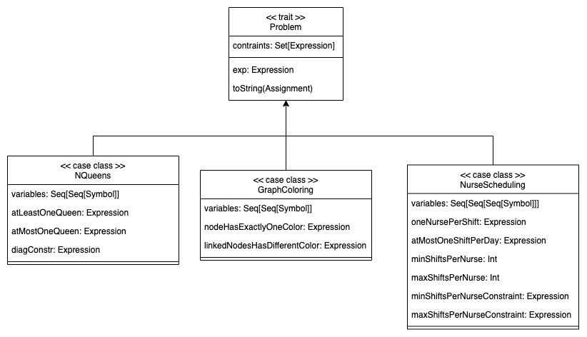
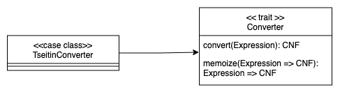

# Detailed Design

---

## Architecture

As described in the previous section, the architectural pattern used is the **Model-View-Update** (MVU).
Moreover, the **Cake Pattern** has been introduced to improve the modeling of the dependencies.

Some _trait_ has been designed to represent the components of the MVU pattern, which encapsulate within them some
_abstract type members_ related to Model, View and Update.


## Model

Concretely, the **Model** will be a private implementation of the _trait_ **State**, which contains the following
abstract types:

### Expression

Expression is represented through a simple _enumeration_ which contains all the possible types of expression.
Through this approach, it is possible to represent the expression as a tree, where each node is an `Expression`.

Symbol is the basic type of expression, containing only a string value representing the name of the expression variable,
while And, Or and Not represent the basic boolean operators.

### Problem



The general Problem representation has been designed with a _trait_ representing the abstract type **Problem**,
for each problem a _case class_ has been defined.
In each case class, the **Problem** trait is extended with the constraints needed to represent the specific problem.
Note that for each problem the expression is composed by a reduction of all constraints.

### Solution

### CNF

CNF is a specific form of representing logical formulas as a conjunction of clauses, where each clause is a disjunction
of literals (variables or their negations), differing from the _Expression_ precisely because of this constraint.
It is implemented through an _enumeration_


---

## View

**View** it will be, as already said, a function that takes as input the **Model** and returns a set of components.
Until now, we have not seen any side effect, but in order to provide a user interface it's necessary having one, so the
**GUI** object is in charge of render the new state of application showing the new updated components.
In this way, every time the **Model** changes, the **GUI** will be correctly updated but without reloading the entire
UI.

---

## Update

The **Update** type will be a function that takes in input the **Model** and a **Message** and returns an updated new
**Model**.
For every type of message one behaviour is defined, so the **Update** function will be a _match_ on the **Message**
type.
Following this approach, combined with the GUI component to update, every interaction with the user will refresh exactly
the needed part of the UI.

## Core

### Converter



Converter is a _trait_ containing the method convert that will be implemented by each converter.
In order to obtain better performances and to avoid the re-computation of same expressions, the converter keeps
a cache of already computed expressions following the _memoization_ pattern.

#### Tseitin Algorithm

The Tseitin algorithm converts a formula in propositional logic into a CNF formula.

In this case, the _Converter_ is in charge of converting the expression in CNF form, using the Tseitin transformation.
It is implemented through a _case class_ that extends the **Converter** trait implementing the convert method.
Following the functional approach, the implementation is hidde inside a private object.

QUI DIAG PACKAGE TSEITIN

The idea behind the Tseitin transformation is to introduce new auxiliary variables for subformulas in the original
formula.
These auxiliary variables are used to represent the truth values of the subformulas.

By doing this, the original formula can be broken down into smaller parts, each represented in CNF, and then combined
using the introduced auxiliary variables to maintain the overall semantics of the original formula.

So, the best way to design it is decomposing the algorithm following the steps below:

1. Assign a unique identifier to each subformula in the original formula.
2. Replace each subformula with an auxiliary variable representing its truth value.
   e.g.

    <p align=center>
        (a ∧ (b ∨ c)) -> (¬c ∧ d)<br>
        TSTN4 <–> ¬c<br>
        TSTN3 <–> b ∨ c<br>
        TSTN2 <–> TSTN4 ∧ d<br>
        TSTN1 <–> a ∧ TSTN3<br>
        TSTN0 <–> TSTN1 –> TSTN2
    </p>

3. Express the truth conditions of the subformulas in CNF using the auxiliary variables and standard logical
   connectives (AND, OR, NOT) following the transformations listed in the table below.

    <table>
        <thead> 
            <tr>
                <th>Operator</th>
                <th>Circuit</th>
                <th>Expression</th>
                <th>Converted</th>
            </tr>
        </thead>
        <tbody>
            <tr>
                <td><b>AND</b></td>
                <td></td>
                <td>X = A ∧ B</td>
                <td>(¬A ∨ ¬B ∨ X) ∧ (A ∨ ¬X) ∧ (B ∨ ¬X)</td>
            </tr>
            <tr>
                <td><b>OR</b></td>
                <td></td>
                <td>X = A ∨ B</td>
                <td>(A ∨ B ∨ ¬X) ∧ (¬A ∨ X) ∧ (¬B ∨ X)</td>
            </tr>
            <tr>
                <td><b>NOT</b></td>
                <td></td>
                <td>X = ¬A</td>
                <td>(¬A ∨ ¬X) ∧ (A ∨ X)</td>
            </tr>
        </tbody>
    </table>

4. Combine the representations of the subformulas to obtain the CNF representation of the entire formula.

The resulting formula is equi-satisfiable with the original formula, meaning they have the same set of satisfying
assignments. This transformation enables the use of various CNF-based algorithms and tools to analyze and reason about
the original logical formula efficiently.

### Solver

Solver is a _trait_ containing the methods useful to solve SAT problem encoded in CNF form.
There are two main possibility to solve a SAT problem instance, one is starting from the CNF form, and the other is
starting directly from the expression.
Furthermore, it is possible to solve the problem looking for all the possible
solutions or only one at a time.
In the last case the solver will convert the expression in CNF with the Converter specified before compute the solution.
In order to obtain better performances and to avoid the re-computation of same expressions,
also the solver make use of _memoization_ pattern.

#### DPLL (Davis-Putnam-Loveland-Logemann)

##### Preliminaries

###### Definition of partial model

We will call elements of $Vars \rightarrow \mathcal{B}$ as partial model, e.g. not all variables are assigned at a given
point of the algorithm.

###### State of the literal

Under partial model $m$,

- a literal $l$ is true if $m(l) = 1$;
- $l$ is false if $m(l) = 0$;
- otherwise $l$ is unassigned.

###### State of the clause

Under a partial model $m$,

- a clause (literals put in $\lor$) is true if there is $l \in C$ such that $l$ is true;
- $C$ is false if for each $l \in C$, $l$ is false;
- otherwise $C$ is unassigned.

###### State of a formula

Under a partial model $m$,

- CNF $F$ is true if for each $C \in F$, $C$ is true;
- CNF $F$ is false if there is $C \in F$, such that $C$ is false.
- otherwise $F$ is unassigned

###### Definition of unit clause and unit literal

$C$ is a unit clause under $m$ if a literal $l \in C$ in unassigned and the rest are false, $l$ is called unit literal.

#### DPLL

- maintains a partial model, initially $\emptyset$
- assigns unassigned variables 0 or 1 randomly one after another
- sometimes forced to choose assignments due to unit literals


###### Unit propagation

Suppose we have the following formula in CNF:

$$(\lnot b \lor c) \land (\lnot c) \land (a \lor \lnot b \lor e) \land (d \lor b)$$

Since $\lnot c$ is the only literal in the clause, if it is false all the formula will be false, so set $c = false$ to
delete the clause and all the others with $\lnot c$ inside. Delete also all the $c$ where the literal appears in
positive form.
On the other hand, if $c$ is in positive form, do viceversa.

###### Pure literals

As a choice to simplify the formula, beyond the unit propagation, it's possible to choose an assignment to a variable (
decision) to a literal which appears only in positive form or only in negative form.

For example:

$$(b \lor c) \land (\lnot c \lor d) \land (a \lor b \lor e) \land (d \lor b)$$

In this case $b$ appears only in positive form, then assigning $b = true$ no other clause will be "penalized", therefore
delete all the other clauses where $b$ is included.

In other words: if $b$ doesn't appear in negative form inside the formula $F$, assigning $b = true$, the satisfability
of $F$ is preserved.

##### Heuristic search

*Idea*: identify the most constrained variable

**MOM**'s heuristic: choose variable based on most occurrence in clauses of minimum length.

## Domain-Specific Language

The user must be able to insert in input a logical expression using a friendly and intuitive syntax, here is an example:

```
!(a and b) or (c and (d -> e))
```

To achieve this goal, it is used an Internal Domain Specific Language (DSL) realized mainly through the _Pimp my
library_ pattern.

Since this mechanism provides a not so versatile syntax (because it strongly depends on Scala syntax) respect to using a
proper parser, the input needs to be preprocessed in order to be adapted to the DSL syntax.

---
[Previous](3-architectural-design.md) | [Next](5-implementation.md)
