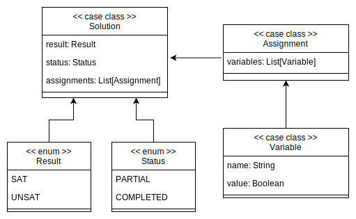
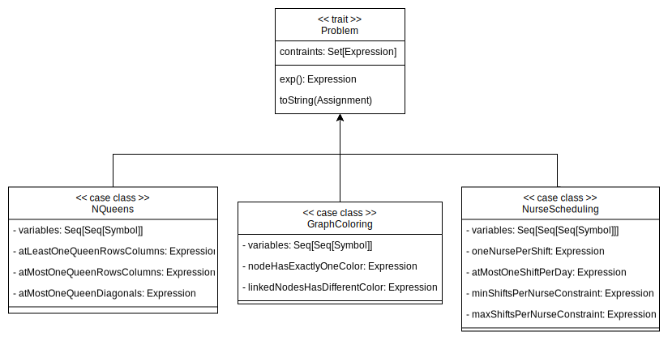
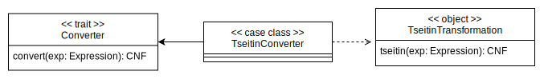
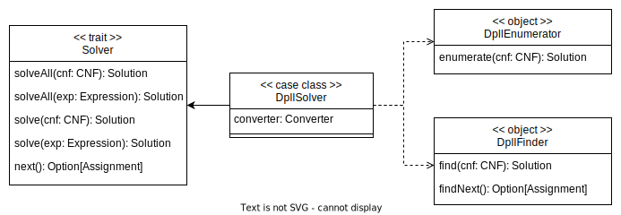
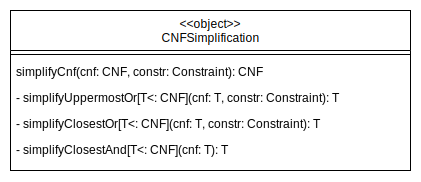

# Detailed Design

---

## Code organization

<p align=center>
  
</p>

---

## Architecture

As described in the previous section, the architectural pattern used is the **Model-View-Update** (MVU).
Moreover, a simplified version of **Cake Pattern** has been introduced to improve the modeling of the dependencies.

Some _trait_ has been designed to represent the components of the MVU pattern, which encapsulate within them some
_abstract type members_ related to `Model`, `View` and `Update`.

<p align=center>
  
</p>

---

## Model

Concretely, the `Model` is an implementation of the _trait_ `State`, which contains the following
abstract types:

### Expression

<p align=center>
  
</p>

Expression is represented through a _sum type_ which contains all the possible types of expression:

- `And`, it represents the logical And gate. It takes in input *left* and *right* parameters both of type `Expression`.
- `Or`, it represents the logical Or gate. Like the `And`, it takes a *left* and *right* `Expressions` in input.
- `Not`, it's the logical Not gate. It takes in input another `Expression`.
- `Symbol`, it represents an input variable and takes in input its name.

Because of its recursive structure, Expression is a tree data structure, where the inner nodes are either
`And`, `Or` or `Not`, and each leaf is a `Symbol`.

Together with the enumeration, a companion object has been created. It provides a set of utilities useful to explore and
manipulate the expression.

### CNF

<p align=center>
  
</p>

`CNF` is the data structure representing logical formulas as a *conjunction* of clauses,
where each clause is a *disjunction* of literals (variables or their negations).

For example:

$$ (a \lor c) \land (a \lor \lnot d) $$

It is a _sum type_ like `Expression`, but it has the following constraints:

- The `Or` gate cannot contain an `And` in either its *left* and *right* parameter.
- The `And` gate cannot contain an `And` in its *left* parameter.
- The `Not` gate can contain only a `Symbol` parameter.
- In this case, `Symbol` can either represent an input variable by specifying its name or a boolean constant by using
  a *Bool* type value.

### Encodings

In SAT problem-solving, cardinality constraints are commonly used to govern the truth values of boolean variables.
These constraints are fundamental in specifying how many variables from a given set can be true, and they are often
referred to as SAT **Encodings**.

Satify provides the possibility to take advantage of the following encodings: `atMostK`, `atLeastK`, `exactlyK`.

#### At most k

At most $k$ refers to the constraint where at most $k$ variables in a set can be true.

The sequential encoding has been chosen. It introduces counting variables, adding constraints to ensure compliance with
the specified limit.

$$
\texttt{atMostK($k$)} := \begin{cases}(\lnot s_{1, j}) \text{ for } 1 < j \leq k \\
(\lnot x_i \lor s_{i,1}) \text{ for } 1 < i < n \\
(\lnot s_{i−1, 1} \lor s_{i, 1}) \text{ for } 1 < i < n \\
(\lnot x_i \lor \lnot s_{i−1, j−1} \lor s_{i,j}) \text{ for } 1 < i < n \text{, } 1 < j \leq k \\
(\lnot s_{i−1, j} \lor s_{i, j}) \text{ for } 1 < i < n \text{, } 1 \leq j \leq k \\
(\lnot x_i \lor \lnot s_{i−1, k}) \text{ for } 1 < i < n \end{cases}
$$

Also `atMostOne` is provided, which is equal to `atMostK(1)`.

#### At least k

At least $k$ refers to the constraint where at least $k$ variables in a set should be true.

The pairwise encoding has been chosen.

$$\texttt{atLeastK($k$)} := \bigvee_{M \subseteq \{ 1, \dots n \} } \bigwedge \limits_{i \in M} x_i$$

where $|M| \geq k$.

Even in this case the `atLeastOne` function is provided, which is equal to `atLeastK(1)`.

#### Exactly k

Exactly $k$ refers to the constraint where exactly $k$ variables in a set should be true.

$$\texttt{exactlyK($k$)} := \texttt{atLeast($k$)} \land \texttt{atMost($k$)}$$

This constraint is also used by the `exactlyOne` function, in particular it's equal to `exactlyK(1)`.

### Solver

The Solver package contains all the abstract types that are useful for SAT solver implementations, especially for
tree-based search algorithms.

It is composed of:

- `DecisionTree`. It's a binary tree data structure where each node contains a `Decision`. It is constructed during
  the search algorithm.
- `Decision`. A decision represents a constraint that has been applied to an input variable. In turn, it contains:
    - A `PartialAssignment`, which is the current state of constraints applied to the variables. The decision is
      implicitly defined in this field. PartialAssignment is a list of `OptionalVariable`, e.g., a variable which could
      be either constrained or not.
    - A `CNF`. It's the input CNF simplified with the current set of constraints defined in `PartialAssignment`.
- `Constraint`. It consists of the name of the variable, and the boolean constraint. It is a utility that could be
  useful during the solving.

<p align=center>
  
</p>

Given these ingredients, a SAT solver implementation can build its own specific `DecisionTree`, applying decisions to
the variables in a certain order and assigning them a certain value that they deem most appropriate for the resolution.

### Solution

`Solution` is the output of a SAT solver run.
It is made up of three fields:

- `Result`: SAT (satisfied) or UNSAT (unsatisfied);
- A set of satisfied `Assignment`s. Compared to the solver modeling, an Assignment consists of a set of `Variable`s,
  which are necessarily constrained to a boolean value.
- `Status`: PARTIAL or COMPLETED. A SAT solver implementation can decide either to provide all the satisfiable
  assignments, just one, or one at a time. Until all the assignments are provided, the Status must be PARTIAL.

<p align="center">

</p>

### Problem

<p align="center">

</p>

The general SAT problem representation has been designed with a _trait_ `Problem`.
It is composed by:

- A set of constraints that must be all satisfied in the solution.
- An `Expression`, which is the reduction of the constraints using the And operator.

Each problem extends `Problem` using a _case class_, and adds the constraints needed to represent the specific
problem.

Links to the SAT problems used in this project:

* N-Queens: https://en.wikipedia.org/wiki/Eight_queens_puzzle
* Graph Coloring: https://en.wikipedia.org/wiki/Graph_coloring
* Nurse Scheduling: https://en.wikipedia.org/wiki/Nurse_scheduling_problem

---

## View

`View` is, as already said, a function that takes as input the `Model` and returns a set of components.
Until now, we have not seen any side effect, but in order to provide a user interface it's necessary having one,
so the `Reactions` object is in charge of render the new state of application showing the new updated components.
In this way, every time the `Model` changes, the GUI will be correctly updated but without reloading the entire
UI.

---

## Update

The `Update` type is a function that takes in input the `Model` and a `Message` and returns an updated new
`Model`.
For every type of message one behaviour is defined, so the `Update` function will be a _match_ on the `Message`
type.
Following this approach, combined with the GUI component to update, every interaction with the user will refresh exactly
the needed part of the UI.

### Converter

<p align="center">

</p>

`Converter` is a functional interface containing the method `convert`.

This _trait_ has a private implementation `TseitinConverter` which implements the `convert` method using
the Tseitin transformation algorithm.

In order to obtain better performances and avoid the re-computation of same expressions, the converter can keep
a cache of already computed expressions following the _memoization_ pattern.

#### Tseitin transformation

The [Tseitin transformation algorithm](https://en.wikipedia.org/wiki/Tseytin_transformation) converts a propositional
expression in Conjunctive Normal Form (CNF).

Since `Converter` has to be the only exposed object to the client, the Tseitin transformation implementation
must be hidden.
To do that, the entire implementation resides in a private _object_, visible only inside the _converter_ package.

It contains the implementation of the three main algorithm phases.

The idea behind the Tseitin transformation is to introduce new auxiliary variables for sub-formulas in the original
formula.

These auxiliary variables are used to represent the truth values of the sub-formulas.

By doing this, the original formula can be broken down into smaller parts, each represented in CNF, and then combined
using the introduced auxiliary variables to maintain the overall semantics of the original formula.

So, the best way to design it is decomposing the algorithm following the steps below:

1. Assign a unique identifier to each sub-formula in the original formula.
2. Replace each sub-formula with an auxiliary variable representing its truth value.
   e.g.

   $$(a \land (b \lor c)) \implies (\lnot c \land d)$$
   $$TSTN_4 \Longleftrightarrow \lnot c$$
   $$TSTN_3 \Longleftrightarrow b \lor c$$
   $$TSTN_2 \Longleftrightarrow TSTN_4 \land d$$
   $$TSTN_1 \Longleftrightarrow a \land TSTN_3$$
   $$TSTN_0 \Longleftrightarrow TSTN_1 \implies TSTN_2$$

   Phases 1 and 2 are combined in the `substitutions` method.

3. Express the truth conditions of the sub-formulas in CNF using the auxiliary variables and standard logical
   connectives (AND, OR, NOT) following the transformations listed in the table below.
   The `transform` method is responsible for this phase, generating a List of CNF clauses that keeps the
   equi-satisfiability of each sub-formula.

| Operator | Circuit                               | Expression | Converted                           |
|----------|---------------------------------------|------------|-------------------------------------|
| AND      |  | X = A ∧ B  | (¬A ∨ ¬B ∨ X) ∧ (A ∨ ¬X) ∧ (B ∨ ¬X) |
| OR       |   | X = A ∨ B  | (A ∨ B ∨ ¬X) ∧ (¬A ∨ X) ∧ (¬B ∨ X)  |
| NOT      |  | X = ¬A     | (¬A ∨ ¬X) ∧ (A ∨ X)                 |

4. Combine the representations of the sub-formulas through `concat` method to obtain the CNF representation of the
   entire formula.

The resulting formula is equi-satisfiable with the original formula, meaning they have the same set of satisfying
assignments. This transformation enables the use of various CNF-based algorithms and tools to analyze and reason about
the original logical formula efficiently.
At the end of the solving process, the auxiliary variables can be eliminated from the solution.

### Solver

<p align="center">

</p>

Solver is a _trait_ containing the methods useful to solve SAT problem encoded in CNF form.

Similar to `Converter`, it has a private implementation `DpllSolver` which implements the methods using
the DPLL algorithm.

There are two main possibilities to solve a SAT problem instance, one is starting from the CNF form, and the other is
starting directly from the expression.
Furthermore, it is possible to solve the problem looking for all the possible solutions or only one at a time.
In the last case, the solver will convert the expression in CNF with the specified Converter before computing the
solution.

To obtain better performances and to avoid the re-computation of same expressions, the solver also makes use of
_memoization_ pattern.

In this project, the _Solver_ that has been used is `DpllSolver`, which exploits the DPLL algorithm.

#### DPLL (Davis-Putnam-Loveland-Logemann)

The [DPLL](https://en.wikipedia.org/wiki/DPLL_algorithm) algorithm is a search algorithm for deciding the satisfiability
of a propositional formula in Conjunctive Normal Form.

Compared to a simple exhaustive search of all the possible variable assignments, DPLL makes use of determined strategies
to guide the search of satisfiable solutions, making it more efficient.
It was introduced in 1961 by Martin Davis, George Logemann and Donald W. Loveland.

The solver implementation provides two ways to perform the resolution. In particular:

- `DpllFinder` is used to get one satisfiable assignment at a time. It exposed two functions: `find` and `findNext`.
  The former takes in input a CNF and returns a `Solution` with a unique assignment, if any. The second one, on the
  other hand, continues to search for another satisfiable assignment, returning a filled optional there is some, empty
  otherwise;
- `DpllEnumerator` enumerates all the possible satisfiable assignments to the problem. It exposes a `enumerate` function
  that returns a `Solution`.

Also in this case, the implementation is private within the _solver_ package, so it can be used only by the `Solver`.

The main ideas behind this algorithm are the following:

- It starts with Branch node of `DecisionTree` where the `PartialAssignment` of `Decision` is composed of all
  unconstrained variables.
- Then, it chooses a variable and a boolean value for branching purposes (decision). On the left side of the Branch that
  variable will be constrained to the chosen value, while on the right with its negated form. A recursive call is done
  on the left, simplifying the CNF with the boolean constraint.
- At each step, it continues to constraint variables until the CNF is completely simplified, or it contains a conflict.
  In the former case, a solution has been found and a Leaf inside the tree is inserted (SAT). In the latter, a false
  clause has been found, which leads to the overall expression false (UNSAT). Also in this case, a Leaf is inserted, and
  the
  computation backtracks to the previous decision, branching on the negated chosen value.

It is good to say that in `DpllEnumerator` the algorithm doesn't stop when only an assignment has been found.
In fact, it continues to search until the `DecisionTree` completely built.

On the other hand, it's a bit more complex for `DpllFinder`. While the DecisionTree in `DpllEnumerator` contains only
SAT/UNSAT leafs, `DpllFinder` can contain not completed Leafs for the reason that an assignment has been found, and no
further exploration is necessary. In order to find another assignment through `findNext`, a mechanism is provided to
save the current state of the `DecisionTree` and resume the computation.

#### Branching strategies

DPLL makes use of two rules to select the most appropriate variable to branch and value: _unit propagation_ and _pure
literal elimination_. If both of them are not applicable, a random decision is made.

They have been introduced inside an object `Optimizations` used by `DpllDecision`.
The latter in turn exposes a `decide` function which will be called by DPLL.

<p align="center">

</p>

##### Unit propagation

Suppose we have the following formula in CNF:

$$(\lnot b \lor c) \land (\lnot c) \land (a \lor \lnot b \lor e) \land (d \lor b)$$

Since $(\lnot c)$ is a clause with only a literal, it is called unit literal. If it is false, all the formula will be
false, so by setting $c = false$ it is possible to simplify the CNF.
Moreover, eliminate the clauses with $\lnot c$ inside. Delete also all the $c$ where the literal appears in positive
form.

On the other hand, if $c$ is in positive form ($(c)$ and not $( \lnot c )$), do vice versa.

This rule creates a left branch with the variable and constraint mentioned and a right UNSAT leaf.
This practice often leads to a cascade of unit propagations, avoiding a large part of search space.

##### Pure literal elimination

As a choice to simplify the formula, beyond the unit propagation, it's possible to choose a constraint to a variable
(decision) to a literal which appears only in positive form or only in negative form.

For example:

$$(b \lor c) \land (\lnot c \lor d) \land (a \lor b \lor e) \land (d \lor b)$$

Here $b$ appears only in positive form (it is a pure literal), then assigning $b = True$ no other clause will be
"penalized", therefore, delete all the other clauses where $b$ is included.

In other words: if $b$ doesn't appear in negative form inside the formula $F$, assigning $b = True$, the satisfiability
of $F$ is preserved.

Eliminating pure literals can significantly reduce the size of the CNF formula. Smaller formulas are often easier and
quicker to process, leading for faster solutions.

#### CNF simplification

<p align="center">
    
</p>

The simplification of the expression in Conjunctive-Normal-Form is very important to determine if the formula is SAT
under the current `PartialAssignment`.

In fact, if the CNF expression is completely simplified, s.t. It is equal to *Symbol(True)*, it can be asserted that it
is SAT.

The expression in CNF is simplified according to the specific logical operator:

- `Or`
    - When a Literal inside an `Or` is set to True s.t. $l = True$ or $\lnot l = True$ then the CNF must be
      simplified on the uppermost `Or` of a sequence of consecutive `Or`s.

      Examples:
    - Literal $A$ in positive form. Constraint $A = True$:

<p align=center>
  
</p>

- Literal $B$ is negated. Constraint $B = False$ sets the literal $True$:

<p align=center>
  
</p>

- When a Literal in an `Or` branch is set to $False$ s.t. $l = False$ or $\lnot l = False$ the CNF must be
  simplified substituting the `Or` with the other branch.

  Examples:
    - Literal $A$ in positive form. Constraint $A = False$:

<p align=center>
  
</p>

- `And`
    - An expression in CNF should be simplified when an $And$ contain at least a $True$ Literal:

      Examples:

    - Constraint $B = True$:

<p align=center>
  
</p>

---

## Domain-Specific Language

The user must be able to insert in input a logical expression using a friendly and intuitive syntax, here is an example:

```
!(a and b) or (c xor (d -> e)) or ((a, b, d) atMost three)
```

To achieve this goal, it is used an Internal Domain Specific Language (DSL) realized mainly through the _Pimp my
library_ pattern.

In particular, the implicitly converted types are:

- `Tuple[String]` to `Seq[Symbol]`
- `String` to `Symbol`

Then, two types are "pimped":

- `Seq[Symbol]`, to apply extension methods for encodings.
- `Expression`, to apply extension methods for logical operators.

Since this mechanism provides a not so versatile syntax (because it strongly depends on Scala syntax) respect to using a
proper parser, the input needs to be preprocessed in order to be adapted to the DSL syntax.

---

[Previous](3-architectural-design.md) | [Next](5-implementation.md)
