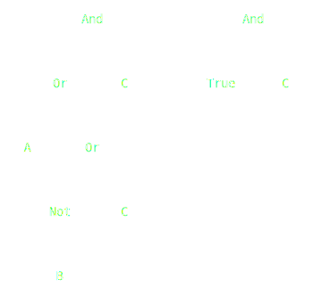
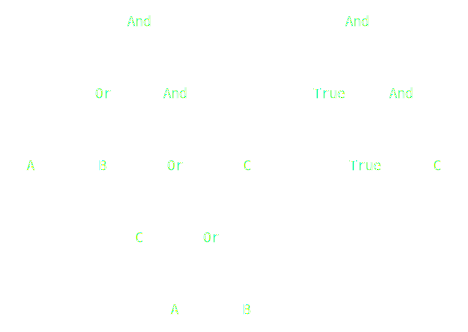
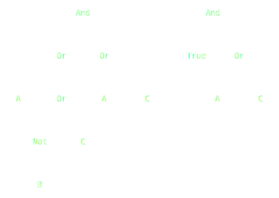
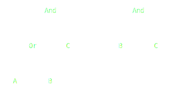
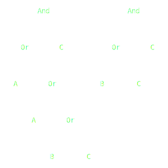
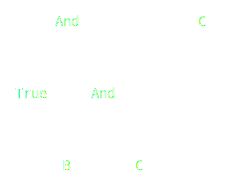
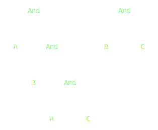

# Implementation

In this section, every group member describes the personal work done for the realization of the project.

---

## Luca Fabri

### DPLL algorithm

My first task was deeply understand the DPLL algorithm. Initially, I spent some time understending how it works in an
high-level view:

- The DPLL algorithm builds a tree of decisions, where each node is a boolean assignment to a variable;
- For each decision, a partial model (e.g. a partial assignment of the variables) is memorized, togheter with the
  updated expression;
- If after an assignment a clause of the expression gives a conflict (e.g. is evaluated false) the entire expression is
  unsat. In this case, the tree is backtracked to the previous decision, in order to let the algorithm to branch on
  another assignment/variable.

The variable to be assigned at a decision branch is chose:

- randomly, if every clause of the expression has more than one literal
- as a unit literal inside a clause of the expression, e.g. a literal which is the only one inside the clause. This
  technique is called unit propagation
- pure literal. If a literal appears only in positive form inside the expression, or only in negative form. This
  techniques are called pure literal elimination.

It is obvious to observe that the complexity of the algorithm is strictly related on choosing the right variable to
branch. In the literature exist a bunch of more heuristics and optimizations.

### Decision tree implementation

Once I understood the problem, I implemented the decision tree data structure that will be used by the DPLL algorithm to
find the possible assignments.

`DecisionTree` is a binary tree where each node implicitly represent the decision and the state of the algorithm
e.g. the current `PartialModel` and `CNF`.
In order to exploit at most the functional programming paradigm they've been implemented using case classes
and `Enum`(s) with the ultimate goal of facilitating the use of match cases.

Before implementing all DPLL subparts individually, I tested the data structure implementing an exhaustive search of all
the possible assignments to the partial model.

### CNF simplification

The simplification of the expression in Cunjuntive-Normal-Form is very important to determine if the formula is SAT
under the current partial model.

In fact, if the CNF expression is completely simplified s.t. it is equal to a `True` constant, it can be asserted
that it is SAT.

The expression in CNF is simplified according to the specific logical operator:

- `Or`
    - When a Literal inside an `Or` is set to `True` s.t. `V = true` or `Not(V) = True` then the CNF must be
      simplified on the uppermost `Or` of a sequence of consecutive `Or`s.

      Examples:
        - Literal `A` in positive form. Constraint `A = True`:

          <p align=center>
            
          </p>

        - Literal `B` is negated. Constraint `B = False` to set the literal `True`:

           <p align=center>
            
          </p>

    - A more complex CNF expression. Constraint `A = True`:

       <p align=center>
        
      </p>

    - Simplify the `Or` only when the variable occurs inside its sub-CNF. Constraint `B = False`:

       <p align=center>
        
      </p>

- When a Literal in an `Or` branch is set to `False` s.t. `V = False` or `Not(V) = False` the CNF must be
  simplified substituting the `Or` with the other branch.

  Examples:
    - Literal `A` in positive form. Constraint `A = False`:
      <p align=center>
        
      </p>

    - A more complex example. Constraint `A = False`:
      <p align=center>
        
      </p>

- `And`
    - An expression in CNF should be simplified when an `And` contains at least a `True` Literal:

      Examples:

        - Constraint `B = True`:
          <p align=center>
            
          </p>

        - A more complex example. Constraint `A = True`:
          <p align=center>
            
          </p>

## Mattia Matteini

### Setup

Initially I dedicated myself to the preparation of the repository and
to the DevOps tasks, so I set up Continuous Integration, SBT, ScalaTest and ScalaFMT.

### Architecture

After that, I was involved in the design and implementation of the software architecture (MVU).
Despite there aren't too many dependencies in MVU, I decided to use the Cake Pattern to still give robustness and
flexibility.

In particular, I made use of the _Self-Type Annotation_ and _Mixin_ mechanisms offered by Scala in order to
manage dependencies between architecture components at compile-time and to create an application instance in a simple
and
readable way.

```scala
trait MVU extends ModelComponent with ViewComponent with UpdateComponent

object Main extends App with MVU
```

### Abstract Modelling

Initially, I implemented the components using _Abstract Modelling_,
because at the start of the project I didn't know yet how
`Model`, `View` and `Update` should have been concretely implemented.
This approach permitted me to focus on high-level design, architecture testing
and to postpone implementation details.

I adopted _Abstract Modelling_ approach also when I started to implement the `Model` entity.
In fact, I knew that the latter had to be an immutable data structure,
but it wasn't really clear how the entities it was supposed to contain should have been implemented.
So I started writing a _trait_ of concepts called `State` (referring to the state of the application),
which was containing the unimplemented main model entities.

### Domain-Specific Language

For the Domain-Specific Language (DSL) creation, I decided to exploit the Scala's _extension methods_ and _given
conversions_, following the _Pimp my library_ pattern.

Before all, I defined a preprocessing part where through the use of a regular expression I wrapped all the non-keywords
with quotes to make them become strings.
During this phase, I also removed all the comments and the newlines escape characters.

Then, I used _reflection_ to execute the processed input string as a Scala code.
The words previously wrapped with quotes are interpreted as strings and implicitly converted to `Symbol` objects,
while the `Tuple[String]` becomes `Seq[Symbol]`.
The use of the _extension methods_ allowed me to call methods and compose expressions using the infix notation.

Using an Internal DSL, I obtained free and correct use of parenthesis and automatic error checking.

The implementation is divided in various _objects_, but to use all the functionalities it is sufficient
to import the `DSL` object which exports all the others.

Finally, to correctly create **atMost** constraints, it is necessary to specify a variable generator.
To do this, and at the same time do not dirty the syntax, I used the _given/using_ mechanism to omit the parameter,
including one time the given instance in the `DSL` imports.

## Alberto Paganelli

Initially, I was involved in the analysis of the Tseitin transformation algorithm and its phases.
In order to obtain a better understanding of the algorithm,
I started to analyze the algorithm's phases, keeping an eye on how to decompose them.
Obviously, the Expression data structure was necessary to represent formulas and work with them, so, with the team, we
defined the `Expression` data structure.

Looking to the algorithm's phases, I started writing some utils method for the `Expression` object that can be used from
all.

In particular, to zip the subexpressions with new Symbols, I made use of a generic type to make the code more reusable.

After the definition of these methods, where I have made great use of Pattern Matching, it was possible to start
implementing the algorithm's phases.

My idea was to exploit the functional programming, so I defined the `Tseitin` object as a singleton object that contains
the algorithm's phases and exposing only the `Tseitin` method as the entry point of the algorithm.
In order to increase the readability of the code, I named methods as the algorithm's phases obtaining a code that is
quite self-explanatory.

```scala
def tseitin(exp: Expression): CNF = concat(substitutions(exp).flatMap(transform))
```

Given that the algorithm is a fundamental part of the project, I decided to develop it following a TDD approach.
When the algorithm was completed, I deemed it necessary to rewrite the substitution phase,
in order to obtain better performances partly by giving up readability.
Given that this algorithm's phase is recursive, I rewrote it in a `@tailrec` way ensuring that the compiler
will optimize the code.

While for the Expression utils and the algorithm I followed a TDD approach, for the GUI I decided to use a
more traditional approach, testing the code manually to verify that it works as expected.

---
[Previous](4-detailed-design.md) | [Next](6-retrospective.md)
