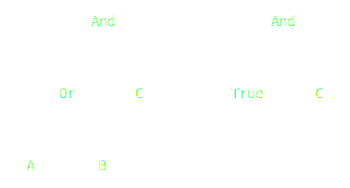
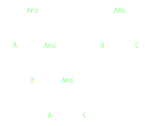

# Implementation

In this section every group member describes the work done for the realization of the project.

## Luca Fabri

### DPLL algorithm

My first task was deeply understand the DPLL algorithm. Initially I spent some time understending how it works in an
high level view:

- The DPLL algorithm builds a tree of decisions, where each node is a boolean assignment to a variable;
- For each decision, a partial model (e.g. a partial assignment of the variables) is memorized, togheter with the
  updated expression;
- If after an assignment a clause of the expression gives a conflict (e.g. is evaluated false) the entire expression is
  unsat. In this case the tree is backtracked to the previous decision, in order to let the algorithm to branch on
  another assignment/variable.

The variable to be assigned at a decision branch is chose:

- randomly, if every clause of the expression has more than one literal
- as a unit literal inside a clause of the expression, e.g. a literal which is the only one inside the clause. This
  technique is called unit propagation
- pure literal. If a literal appears only in positive form inside the expression, or only in negative form. This
  techniques is called pure literal elimination.

It is obvious to observe that the complexity of the algorithm is strictly related on choosing the right variable to
branch. In the literature exist a bunch of more heuristics and optimizations.

### Decision tree implementation

Once I understood the problem, I implemented the decision tree data structure that will be used by the DPLL algorithm to find the possible assignments.

```DecisionTree``` is a binary tree where each node implicitly represent the decision and the state of the algorithm e.g. the current ```PartialModel``` and ```CNF```.
In order to exploit at most the functional programming paradigm they've been implemented using case classes and ```Enum```(s) with the ultimate goal of facilitating the use of match cases.

Before implementing all DPLL subparts individually, I tested the data structure implementing an exhaustive search of all the possible assignments to the partial model.

### CNF simplification

The simplification of the expression in Cunjuntive-Normal-Form is very important to determine if the formula is SAT under the current partial model.

In fact, if the CNF expression is completely simplified s.t. it is equal to a ```True``` constant, it can be asserted that it is SAT.

The expression in CNF is simplified according to the specific logical operator:
- ```Or```
    - When a Literal inside an ```Or``` is set to ```True``` s.t. `V = true` or `Not(V) = True` then the CNF must be simplified on the uppermost `Or` of a sequence of consecutive `Or`s.

      Examples:
        - Literal `A` in positive form. Constraint `A = True`:

          <p align=center>
            
          </p>

        - Literal `B` is negated. Constraint `B = False` to set the literal `True`:

           <p align=center>
            
          </p>


    - A more complex CNF expression. Constraint `A = True`: 

       <p align=center>
        
      </p>


    - Simplify the `Or` only when the variable occurs inside its sub-CNF. Constraint `B = False`: 

       <p align=center>
        
      </p>

- When a Literal in an ```Or``` branch is set to ```False``` s.t. `V = False` or `Not(V) = False` the CNF must be simplified substituting the `Or` with the other branch.

  Examples:
    - Literal `A` in positive form. Constraint `A = False`:
      <p align=center>
        
      </p>

    - A more complex example. Constraint `A = False`:
      <p align=center>
        
      </p>

- `And`
    - An expression in CNF should be simplified when an `And` contains at least a `True` Literal:

      Examples:

        - Constraint `B = True`:
          <p align=center>
            
          </p>

        - A more complex example. Constraint `A = True`:
          <p align=center>
            
          </p>


## Mattia Matteini

Initially I dedicated myself to the preparation of the repository and
to the DevOps tasks, so I set up Continuous Integration, SBT, ScalaTest and ScalaFMT.

After that I was involved in the design and implementation of the software architecture (MVU).
I decided to use the Cake Pattern despite there aren't too many dependencies in MVU, to still give robustness,
substitutability and flexibility.

In particular, I made use of the _Self-Type Annotation_ and _Mixin_ mechanisms offered by Scala in order to
manage dependencies between pattern components at compile-time and to create an application instance in a simple and
readable way

```scala
trait MVU extends ModelComponent with ViewComponent with UpdateComponent

object Main extends App with MVU
```

## Alberto Paganelli

My first task was to analyze in depth the Tseitin transformation algorithm and before the implementation defining the data structures collaborating with the team.
After the definition of a data structure I started to define the algorithm's phases.

The first defined data structure was the Enumeration `Expression` that represents the expression of the formula in the enumeration form.
Looking to the algoritm's phases I started writing some utils method for the `Expression` object that can be used from all.
In particular to zip the subexpressions with new variables I made use of generic type to make the code more reusable.

After the definition of these methods, where I have made great use of Pattern Matching, it was possible to start implementing the algorithm's phases.

The idea was to use the functional programming, so I defined the `Tseitin` object as a singleton object that contains the algorithm's phases and exposing only the `tseitin` method that is the entry point of the algorithm.

I followed the TDD approach for the core of the algorithm and for the utils methods.


## Tseitin Algorithm

The Tseitin algorithm converts a formula in propositional logic into a CNF formula.

CNF is a specific form of representing logical formulas as a conjunction of clauses, where each clause is a disjunction
of literals (variables or their negations).

The idea behind the Tseitin transformation is to introduce new auxiliary variables for subformulas in the original
formula. These auxiliary variables are used to represent the truth values of the subformulas.

By doing this, the original formula can be broken down into smaller parts, each represented in CNF, and then combined
using the introduced auxiliary variables to maintain the overall semantics of the original formula.

The Tseitin transformation follows these steps:

1. Assign a unique identifier to each subformula in the original formula.
2. Replace each subformula with an auxiliary variable representing its truth value.
<p align=center>
(a ∧ (b ∨ c)) -> (¬c ∧ d)<br>
TSTN4 <--> ¬c<br>
TSTN3 <--> b ∨ c<br>
TSTN2 <--> TSTN4 ∧ d<br>
TSTN1 <--> a ∧ TSTN3<br>
TSTN0 <--> TSTN1 --> TSTN2
</p>
3. Express the truth conditions of the subformulas in CNF using the auxiliary variables and standard logical
   connectives (AND, OR, NOT) following the transformations listed in the table below.
<table>
    <thead> 
        <tr>
            <th>Operator</th>
            <th>Circuit</th>
            <th>Expression</th>
            <th>Converted</th>
        </tr>
    </thead>
    <tbody>
        <tr>
            <td><b>AND</b></td>
            <td></td>
            <td>X = A ∧ B</td>
            <td>(¬A ∨ ¬B ∨ X) ∧ (A ∨ ¬X) ∧ (B ∨ ¬X)</td>
        </tr>
        <tr>
            <td><b>OR</b></td>
            <td></td>
            <td>X = A ∨ B</td>
            <td>(A ∨ B ∨ ¬X) ∧ (¬A ∨ X) ∧ (¬B ∨ X)</td>
        </tr>
        <tr>
            <td><b>NOT</b></td>
            <td></td>
            <td>X = ¬A</td>
            <td>(¬A ∨ ¬X) ∧ (A ∨ X)</td>
        </tr>
    </tbody>
</table>

4. Combine the representations of the subformulas to obtain the CNF representation of the entire formula.

The resulting formula is equi-satisfiable with the original formula, meaning they have the same set of satisfying
assignments. This transformation enables the use of various CNF-based algorithms and tools to analyze and reason about
the original logical formula efficiently.


---
[Previous](4-detailed-design.md) | [Next](6-retrospective.md)
